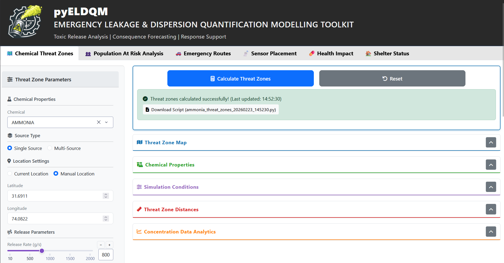
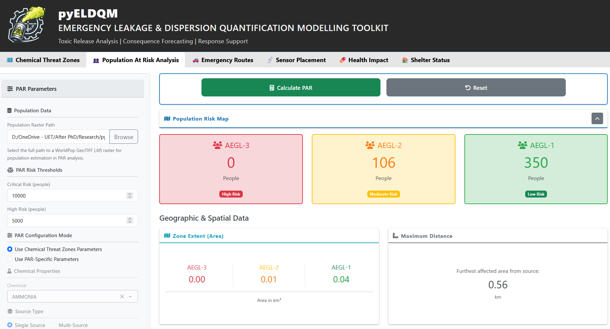
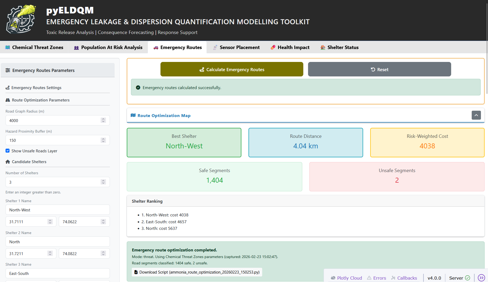
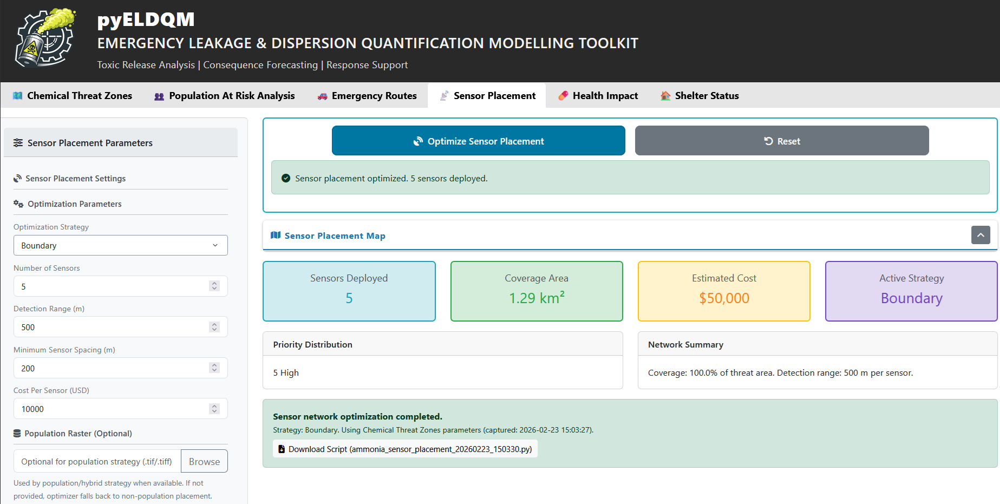
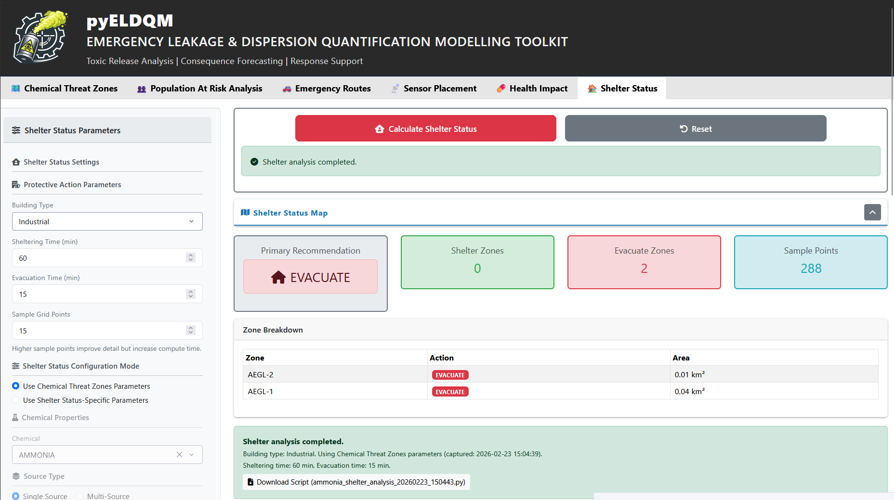

<p align="center"></p>

[](https://github.com/SIHPCC/pyeldqm/actions/workflows/ci.yml)
[](https://www.python.org/)
[](LICENSE)

pyELDQM is an open-source, modular toolkit for real-time chemical emergency modelling.
It provides Gaussian plume / puff dispersion, dense-gas (Britter-McQuaid), fire & explosion
consequence models, PAR (Protective Action Recommendation) analysis, evacuation route
optimisation, and an interactive Dash web application — all in pure Python.

**Author:** Dr. Zohaib Atiq Khan

**Other Contributors:**
- Dr. Muhammad Imran Rashid
- Mr. Muhammad Ahmad
- Ms. Aroosa Dilbar
- Mr. Muhammad Saleem Akhtar
- Ms. Fatima

---

## Features

| Module | Description |
|---|---|
| **Dispersion** | Gaussian plume/puff (single & multi-source), dense-gas Britter-McQuaid ODE |
| **Source models** | Gas pipeline leaks, pressurised tank gas/liquid/two-phase releases, puddle evaporation |
| **Fire & explosion** | Pool fire, jet fire thermal flux; flash-fire radius; BLEVE |
| **Meteorology** | Pasquill-Gifford stability classification, Monin-Obukhov / power-law wind profiles, solar insolation |
| **Health thresholds** | AEGL, ERPG, IDLH, PAC look-up from SQLite chemical database |
| **Consequences** | AEGL/ERPG hazard-zone footprints from dispersion output |
| **PAR analysis** | Shelter-in-place vs. evacuation decision support with population raster integration |
| **Sensor placement** | Coverage-optimised sensor network design |
| **Evacuation routing** | OpenStreetMap-based route optimisation (osmnx / networkx) |
| **Web app** | Interactive Dash 2 dashboard with real-time threat maps (Folium/Leaflet) |

---

## Installation

> **Recommended:** Install pyELDQM inside a dedicated virtual environment to avoid
> package conflicts with other projects on your system.

```bash
# 1. Create and activate a virtual environment
python -m venv pyeldqm-env

# Windows
pyeldqm-env\Scripts\activate
# macOS / Linux
source pyeldqm-env/bin/activate

# 2. Install pyELDQM
pip install pyeldqm
```

### Conda installation (local build)

```bash
# 1. Create and activate a conda environment
conda create -n pyeldqm python=3.14
conda activate pyeldqm

# 2a. Install published release from PyPI
pip install pyeldqm

# 2b. OR install from local source (development / editable)
pip install -e .
```

> **Important:** Always use `pip install -e .` (note the `-e` flag) when
> installing from a cloned source tree. Omitting `-e` will cause a
> *"unable to open database file"* error and missing-module errors.

### Development install

```bash
git clone https://github.com/SIHPCC/pyeldqm.git
cd pyeldqm
python -m venv .venv
# Windows:  .venv\Scripts\activate
# macOS/Linux: source .venv/bin/activate
pip install -e .
```

---

## Quick start

### Launch the web application

```bash
pyeldqm-app
# → http://localhost:8050
```

Environment variables (all optional):

| Variable | Default | Description |
|---|---|---|
| `PORT` | `8050` | Listening port |
| `HOST` | `localhost` | Bind address |
| `DEBUG` | `true` | Dash debug mode |

### Python API

```python
import pyeldqm as eldqm

from pyeldqm.core.dispersion_models.gaussian_model import calculate_gaussian_dispersion

config = {
    "source": {"lat": 14.60, "lon": 121.03, "Q_gs": 1.5},
    "chemical": {"name": "chlorine", "MW": 70.91},
    "meteorology": {"wind_speed_ms": 3.0, "wind_direction_deg": 270,
                    "stability_class": "D", "roughness": "RURAL"},
    "grid": {"x_max_m": 3000, "y_max_m": 1500, "nx": 200, "ny": 100},
}
result = calculate_gaussian_dispersion(config)
```

```python
import pyeldqm as eldqm

from pyeldqm.core.source_models.gas_pipeline.pipeline_leak import simulate_pipeline_leak

result = simulate_pipeline_leak(duration_s=600, dt=60)
print(result["Qt"])   # mass-flow rate time-series [kg/s]
```

```python
import pyeldqm as eldqm

from pyeldqm.core.health_thresholds import get_all_thresholds

thresholds = get_all_thresholds("ammonia")
print(thresholds["AEGL"])   # {'AEGL-1': 30.0, 'AEGL-2': 160.0, 'AEGL-3': 1100.0}
```

---

## Scenario configuration (YAML)

Pre-built scenarios live in `configs/`:

| File | Scenario |
|---|---|
| `base_config.yaml` | Generic Gaussian dispersion |
| `chlorine_pipeline_leak.yaml` | Chlorine pipeline rupture |
| `ammonia_tank_release.yaml` | Pressurised ammonia tank release |
| `lpg_bleve.yaml` | LPG pool fire / BLEVE |
| `realtime_monitoring.yaml` | Live weather + multi-source |

---

## Project structure

```
pyELDQM/
├── app/                         # Dash web-application layer
│   ├── assets/                  # CSS and static assets
│   ├── callbacks/               # Dash callback modules
│   ├── components/              # Reusable UI components
│   │   └── tabs/                # Per-tab component modules
│   ├── layout/                  # Page layout (tabs, sidebar, header)
│   └── utils/                   # App utilities
│       └── script_generator/    # Auto-generated Python script templates
├── cache/                       # Runtime cache files
├── configs/                     # Example YAML scenario files
├── core/                        # Pure-Python scientific library
│   ├── dispersion_models/       # Gaussian plume/puff + dense-gas (Britter-McQuaid)
│   ├── evacuation/              # Route optimisation (osmnx / networkx)
│   ├── fire_models/             # Pool fire, jet fire, flash fire, BLEVE
│   ├── geography/               # Geographic helpers and coordinate utilities
│   ├── meteorology/             # Stability, wind profile, solar radiation, real-time weather
│   ├── population/              # Population raster I/O, GHSL/WorldPop download helpers
│   ├── protective_actions/      # Shelter-in-place analysis models
│   ├── source_models/           # Pipeline, tank (gas/liquid/two-phase), puddle source terms
│   │   ├── gas_pipeline/
│   │   ├── tank_release/
│   │   └── puddle_evaporation/
│   ├── utils/                   # Shared utilities (grid setup, zone extraction, sensor optimisation)
│   └── visualization/           # Folium map builders and zone layer rendering
├── data/                        # Reference data (not bundled in wheel)
│   ├── chemicals_database/      # SQLite chemical properties database
│   ├── geographic_data/         # Facility GeoJSON files
│   ├── population/              # Population raster data (WorldPop / GHSL GeoTIFF)
│   ├── thermodynamics_data/     # Phase equilibrium CSV data
│   └── weather_samples/         # Sample weather CSV files
├── docs/                        # Documentation assets
│   └── images/                  # Gallery screenshots
├── examples/                    # Standalone tutorials and scripts
│   ├── notebooks/               # Jupyter tutorial notebooks (01–06)
│   └── scripts/                 # Standalone Python example scripts (01–12)
├── outputs/                     # Generated outputs (maps, reports)
│   ├── realtime_threat_zones/
│   ├── reports/
│   └── threat_zones/
├── tests/                       # pytest test suite
├── validation/                  # Model validation scripts and metrics
│   └── validation_scripts/
├── CHANGELOG.md
├── CONTRIBUTING.md
├── LICENSE
├── MANIFEST.in
├── README.md
├── pyproject.toml               # Packaging & tool configuration
├── requirements.txt
└── run_app.py
```

---

## Gallery

| Screenshot | Description |
|---|---|
|  | Chemical Threat Zones|
|  | Population At Risk analysis |
|  | Emergency route optimization |
|  | Sensor network optimization |
|  | Health impact threshold zones |
|  | Shelter-in-place vs evacuation guidance |

---

## Running tests

```bash
pytest tests/ --cov=core --cov-report=term-missing
```

The test suite covers dispersion utilities, meteorology, health thresholds, geographic
constants, source models, fire models, and consequence models (~65 tests).

---

## Contributing

See [CONTRIBUTING.md](CONTRIBUTING.md) for setup instructions, coding standards, and the
pull-request workflow.

---

## License

MIT — see [LICENSE](LICENSE).